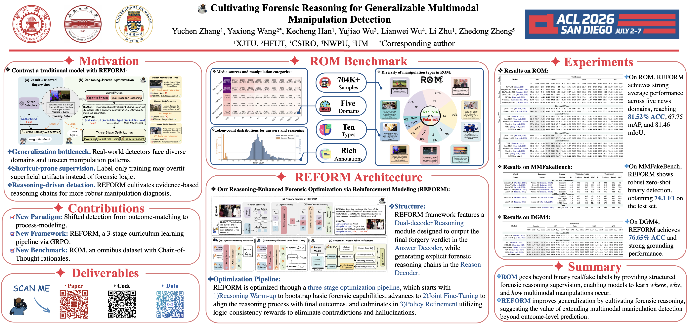

# Cultivating Forensic Reasoning for Generalizable Multimodal Manipulation Detection


<font size=4><div align='center'>[\[📄 Paper\]](https://arxiv.org/abs/2603.01993) &nbsp; [\[🗂️ Dataset\]](https://www.modelscope.cn/datasets/YcZhangSing/ROM)</div></font>

## 📌 Overview

**REFORM** improves generalization by cultivating forensic reasoning, suggesting the value of extending multimodal manipulation detection beyond outcome-level prediction.

**ROM** goes beyond binary real/fake labels by providing structured forensic reasoning supervision, enabling models to learn where, why, and how multimodal manipulations occur.

## 🔬 REFORM

REFORM supports multimodal forensic understanding tasks including authenticity detection, fine-grained manipulation type prediction, manipulated region grounding, and forensic rationale generation.


The training pipeline has three stages:

1. **Cognitive Reasoning Warm-up**
2. **Reasoning-Endowed Joint Fine-Tuning**
3. **Constraint-Aware Policy Refinement**

## ⚙️ Setup

```shell
conda create -n REFORM python=3.10
conda activate REFORM
pip install -r requirements.txt
```

If you encounter issues with flash-attn, you can fix it with:

```shell
pip install -U flash-attn --no-build-isolation
```

Alternatively, visit the [flash-attention releases page](https://github.com/Dao-AILab/flash-attention/releases) to find the version compatible with your CUDA, PyTorch, and Python environment.

The original experiments were run with a local Python environment equivalent to:

```shell
/mnt/da36552c-a636-46f9-9a37-676e692003a2/yuchen/condaEnvs/florence2/bin/python
```

## 🗂️ ROM Dataset

ROM is short for **Reasoning-enhanced analysis for Omnibus Manipulation dataset**. It contains five news domains:

- NYT
- Guardian
- BBC
- USAToday
- Wash

NYT and Guardian provide train/validation/test splits. BBC, USAToday, and Wash are test-only domains in this release; their original train/validation/test source files are merged into one test split per domain.

Dataset download:

- ROM: [ModelScope](https://www.modelscope.cn/datasets/YcZhangSing/ROM)
- DGM4-Guardian-reasoning: [ModelScope](https://www.modelscope.cn/datasets/YcZhangSing/DGM4-Guardian-Train)


Each metadata item keeps only:

```json
{
  "id": "ROMNYT00000001",
  "image": "train/NYT/images/ROMNYT00000001.jpg",
  "text": "...",
  "fake_cls": "orig",
  "fake_image_box": [],
  "Internvl_out_think": "..."
}
```

`Internvl_out_think` is only present for the ROM-NYT, and Guardian training splits.

### Export Local Data

If you have the original local dataset paths, export the public ROM layout with:

```shell
python scripts/export_rom_dataset.py \
  --output-root /mnt/da36552c-a636-46f9-9a37-676e692003a2/yuchen/REFORM_ROMdataset \
  --workers 16
```

The exporter copies images, rewrites image paths to relative paths, regenerates sample IDs as `ROM{Domain}{Number}`, and writes one `meta.json` per split/domain.

### Labels

| `fake_cls` | Meaning |
| --- | --- |
| `orig` | A. No Fake |
| `face_swap` | B. Image: Face swap; Text: No. |
| `face_attribute` | C. Image: Face attribute; Text: No. |
| `full_gene` | D. Image: Whole generated; Text: No. |
| `bg_rep` | E. Image: Inpainted background; Text: No. |
| `face_swap&text_swap` | F. Image: Face swap; Text: Fully rewritten. |
| `face_attribute&text_swap` | G. Image: Face attribute; Text: Fully rewritten. |
| `full_gene&text_swap` | H. Image: Whole generated; Text: Fully rewritten. |
| `bg_rep&text_swap` | I. Image: Inpainted background; Text: Fully rewritten. |
| `text_swap` | J. Image: No; Text: Fully rewritten. |

## 🏋️ Training

Set these common paths first:

```shell
export ROM_ROOT=/path/to/REFORM_ROMdataset
export REFORM_model=/path/to/REFORM/models
```

To train REFORM, you need to download the pretrained [Florence-2 base model](https://huggingface.co/microsoft/Florence-2-base-ft/tree/main).
After downloading, place the `pytorch_model.bin` file into the `REFORM/models/` directory.

### Stage 1: Cognitive Reasoning Warm-up

Train for 4 epochs and use the epoch-4 checkpoint for stage 2.

```shell
python scripts/train_stage1_reasoning_warmup.py \
  --train-json ${ROM_ROOT}/train/Guardian/meta.json \
  --val-json ${ROM_ROOT}/val/Guardian/meta.json \
  --dataset-root ${ROM_ROOT} \
  --model-path ${REFORM_model} \
  --reform-model-path ${REFORM_model} \
  --output-dir outputs/stage1_guardian \
  --epochs 4
```

### Stage 2: Reasoning-Endowed Joint Fine-Tuning

Train for 13 epochs and use the best validation-accuracy checkpoint for stage 3.

```shell
python scripts/train_stage2_joint_finetune.py \
  --train-json ${ROM_ROOT}/train/Guardian/meta.json \
  --val-json ${ROM_ROOT}/val/Guardian/meta.json \
  --dataset-root ${ROM_ROOT} \
  --model-path outputs/stage1_guardian/train_*/epoch_4 \
  --reform-model-path ${REFORM_model} \
  --output-dir outputs/stage2_guardian \
  --epochs 13
```

### Stage 3: Constraint-Aware Policy Refinement

First convert ROM metadata into the GRPO/VLM format:

```shell
python scripts/convert_rom_to_vlm_format.py \
  --input ${ROM_ROOT}/train/Guardian/meta.json \
  --output outputs/rl_data/guardian_train_vlm.json \
  --dataset-root ${ROM_ROOT}
```

Then launch policy refinement:

```shell
export CKPT_PATH=/path/to/stage2/best_ckpt
export DATA_PATHS=outputs/rl_data/guardian_train_vlm.json
export TEST_DATA_PATHS=outputs/rl_data/guardian_val_vlm.json
bash scripts/train_stage3_policy_refinement.sh
```

## 🔍 Inference

REFORM uses two decoder branches: one decoder predicts the final answer and the other generates forensic reasoning.

Fast model mode disables reasoning generation and only returns the answer:

```shell
python scripts/evaluate_reform.py \
  --model-id /path/to/reform_checkpoint \
  --data-files ${ROM_ROOT}/test/NYT/meta.json \
  --dataset-root ${ROM_ROOT} \
  --mode fast
```

Explainable model mode enables both branches:

```shell
python scripts/evaluate_reform.py \
  --model-id /path/to/reform_checkpoint \
  --data-files ${ROM_ROOT}/test/NYT/meta.json \
  --dataset-root ${ROM_ROOT} \
  --mode explainable
```

## 📊 Results

REFORM achieves strong performance on multiple multimodal forensic benchmarks, including:

- **81.52% ACC** on **ROM**
- **76.65% ACC** on **DGM4**
- **74.9 F1** on **MMFakeBench**

## 📚 Citation

If this work is relevant to your research, please cite:

```bibtex
@article{zhang2026process,
  title={Process Over Outcome: Cultivating Forensic Reasoning for Generalizable Multimodal Manipulation Detection},
  author={Zhang, Yuchen and Wang, Yaxiong and Han, Kecheng and Wu, Yujiao and Wu, Lianwei and Zhu, Li and Zheng, Zhedong},
  journal={arXiv preprint arXiv:2603.01993},
  year={2026},
  url={https://arxiv.org/abs/2603.01993}
}
```

## 🙏 Acknowledgements

We thank the DGM4 and Florence-2 projects for their open-source resources.
