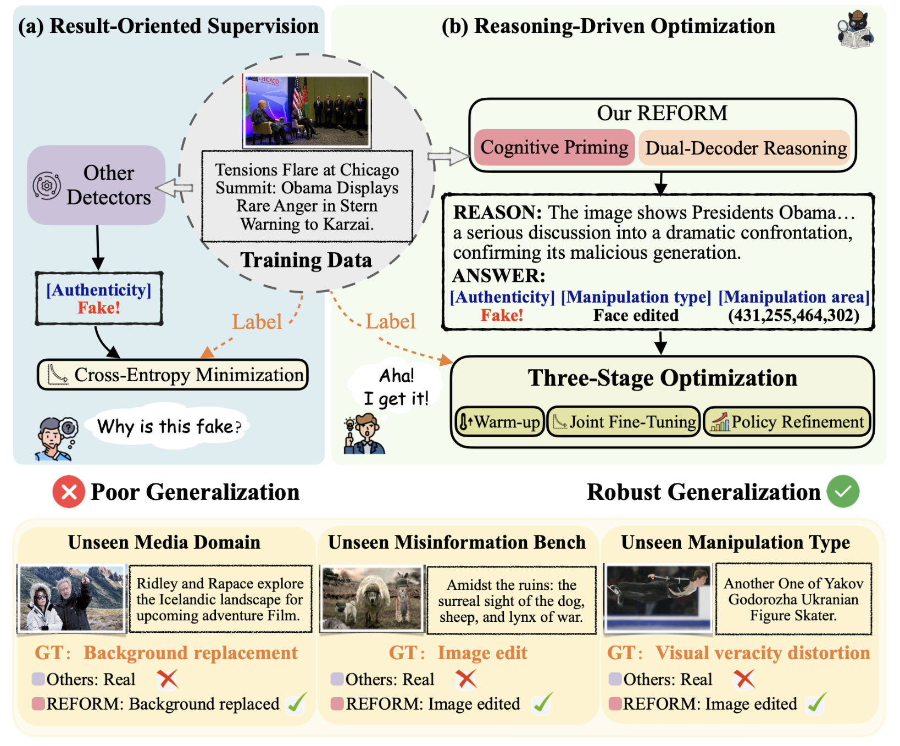
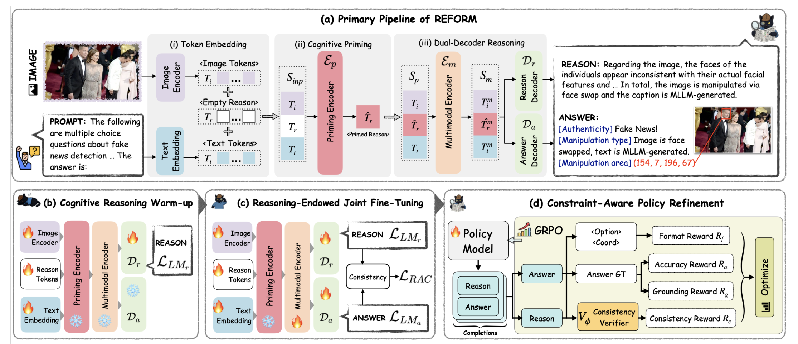
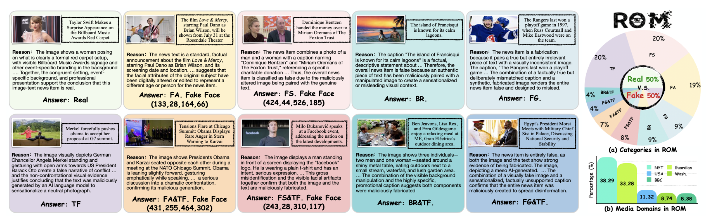

# Process Over Outcome for Generalizable Multimodal Manipulation Detection

**REFORM** is a reasoning-driven framework for generalizable multimodal manipulation detection. Instead of only optimizing for final predictions, REFORM explicitly models the forensic reasoning process to improve robustness, interpretability, and cross-domain generalization.



## 🔥 Overview

REFORM is designed for multimodal forensic understanding, including:

- authenticity detection
- fine-grained manipulation type prediction
- manipulated region grounding
- forensic rationale generation

The framework introduces a reasoning-oriented learning paradigm for multimodal manipulation detection, aiming to move from **outcome supervision** to **process modeling**.

## ⚙️ Method



REFORM consists of:

- a cognitive priming mechanism with learnable reason tokens
- a dual-decoder design for answer prediction and rationale generation
- a three-stage training pipeline:
    - Cognitive Reasoning Warm-up
    - Reasoning-Endowed Joint Fine-Tuning
    - Constraint-Aware Policy Refinement

## 📊 Results

REFORM achieves strong performance on multiple multimodal forensic benchmarks, including:

- **81.52% ACC** on **ROM**
- **76.65% ACC** on **DGM4**
- **74.9 F1** on **MMFakeBench**

## Code

**Coming Soon.**

The source code will be released after the paper is formally accepted.

## Dataset

**Coming Soon.**



Dataset access and related resources will be released after the official publication process is completed.

## 🗞️ News

- **`2026-03-02`**: We release the REFROM repository.

## 🧑‍🎓 Citation

If this work is relevant to your research, please cite:

```bibtex

```


## 🤝 Acknowledgements

We sincerely thank projects [DGM4](https://github.com/rshaojimmy/MultiModal-DeepFake), [FKA-Owl](https://github.com/liuxuannan/FAK-Owl), and [Florence2](https://github.com/andimarafioti/florence2-finetuning) for providing their open-source resources.
